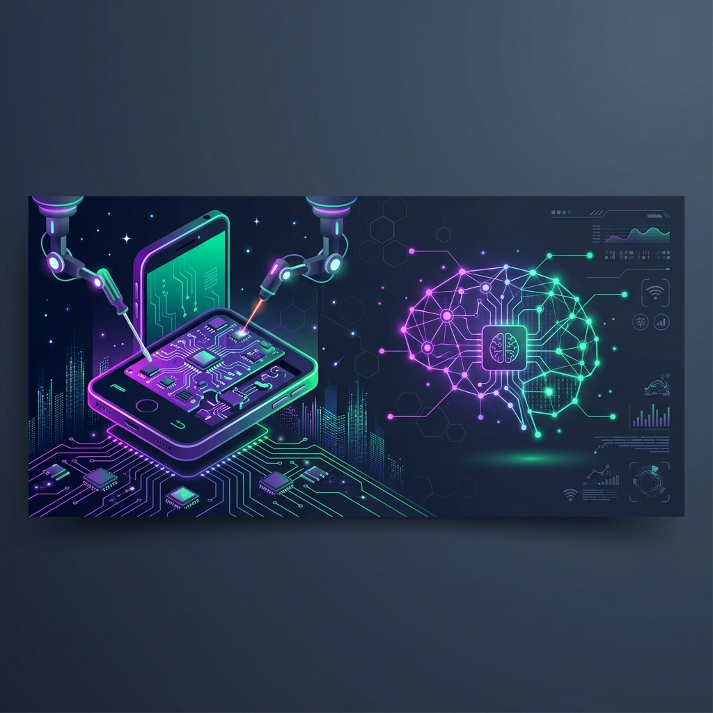

# TeknikZeka - Yapay Zekâ Destekli Teknik Servis Yönetim Sistemi

Geleneksel arıza tespit süreçlerini Llama 3 70B (Groq) Yapay Zekâ modeli ile hızlandıran, müşteri ile teknik servisi "İhale Mantığı" ile tek bir platformda buluşturan modern bir B2C web uygulaması.



**Canlı Demo (Hemen Deneyin):** [https://samehmet00.github.io/teknikzeka/](https://samehmet00.github.io/teknikzeka/)

## Projenin Amacı
Cihazı bozulan kullanıcılar genellikle sorunun ne olduğunu tam olarak bilemez ve teknik servise eksik bilgi verir. Servisler ise arıza tespitine saatlerini harcar. **TeknikZeka**, müşterinin girdiği basit şikayetleri gelişmiş dil modelleriyle analiz ederek anında donanımsal bir "Ön Teşhis Raporu" oluşturur. Oluşturulan bu biletler (ticket) yerel servislere düşer ve servisler cihazı tamir etmek için müşteriye talep gönderir.

## Öne Çıkan Özellikler

### Yapay Zeka Entegrasyonu (Llama 3 70B via Groq)
* Müşteri şikayetini okuyup saniyeler içinde **Olası Arıza**, **Zorluk Derecesi (1-10)** ve **Önerilen Çözüm** sunar.
* Gereksiz sohbetleri filtreleyen katı bir *Prompt Engineering* yapısı kullanır. Groq API'nin hızı sayesinde anında sonuç döndürür.

### Çift Taraflı Rol Yönetimi (Firebase Auth)
* **Müşteri Paneli:** Yeni arıza kaydı oluşturma, geçmiş talepleri görme ve teklif veren servisler arasından seçim yapma. Modüler yapı ile biletler temiz bir `tickets.html` sayfasında listelenir.
* **Teknik Servis Paneli:** Sisteme düşen tüm arıza kayıtlarını "Akordiyon" menü yapısında detaylıca inceleme ve "Ben Yapabilirim" diyerek ihaleye katılma. Mobil uyumlu, katlanabilir filtreleme özellikleri sunar.

### Modern ve Dinamik Kullanıcı Arayüzü (UI/UX)
* **Premium Tasarım:** Cam efekti (glassmorphism), gradient kenarlıklar, koyu/açık tema ve kusursuz tipografi ile "WOW" dedirten profesyonel bir arayüz.
* **Vektör İkonlar:** Sistem genelinde yüksek çözünürlüklü SVG ikonlar kullanılarak net ve profesyonel bir görünüm elde edilmiştir.
* **Swipe-to-Delete:** Müşteri panelinde kayıtları iOS/Android uygulamalarındaki gibi kaydırarak silme animasyonu.
* **Sinematik Kaydırma:** Ana sayfada (Landing Page) Scroll-Jacking ve Intersection Observer ile tetiklenen modern metin animasyonları.

## Kullanılan Teknolojiler

* **Frontend:** HTML5, CSS3 (Custom Properties & Animations), Vanilla JavaScript (ES6 Modules). *(Herhangi bir harici framework kullanılmamıştır).*
* **Backend / BaaS:** Firebase Authentication, Cloud Firestore (Gerçek zamanlı NoSQL veritabanı).
* **Yapay Zeka:** Llama 3 70B modeli (Groq API üzerinden).

## Kurulum ve Çalıştırma

Projeyi kendi bilgisayarınızda (Localhost) çalıştırmak için aşağıdaki adımları izleyin:

1. Projeyi bilgisayarınıza klonlayın:
   ```bash
   git clone https://github.com/samehmet00/teknikzeka.git
   ```

2. Klonladığınız klasörün içine girin:
   ```bash
   cd teknikzeka
   ```

3. Güvenlik nedeniyle projede yer alan `js/firebase-config.js` dosyasının içindeki konfigürasyon bilgilerini kendi Firebase projenizin ayarlarıyla değiştirin. Ayrıca Firestore veritabanınızda `tickets` adında bir koleksiyon oluşturmayı unutmayın.

4. `js/app.js` içerisindeki `GROQ_API_KEY` değişkenine kendi Groq API anahtarınızı girin.

5. VS Code kullanıyorsanız Live Server eklentisi ile `index.html` dosyasını çalıştırın.

> Önemli Not: Projede ES6 Modülleri (`type="module"`) kullanıldığı için uygulamanın düzgün çalışması adına tarayıcıda dosyaya çift tıklayarak (`file:///`) açmak yerine, kesinlikle bir yerel sunucu (localhost / Live Server) üzerinden açılması gerekmektedir.

## Geliştirici
Bu proje, İnternet Programcılığı dersi kapsamında geliştirilmiştir.

Geliştirici: Mehmet ŞA - İnönü Üniversitesi Bilgisayar Mühendisliği 

GitHub: [samehmet00](https://github.com/samehmet00)